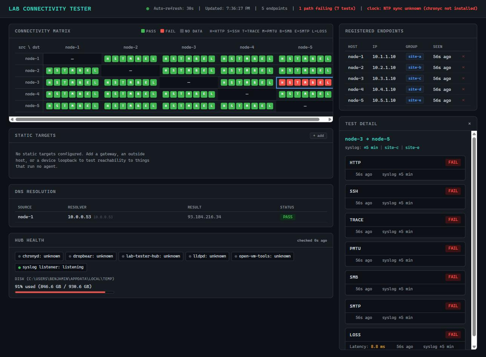

# Lab Tester

> **AI disclaimer:** This project was created using [Claude Code](https://claude.com/claude-code).

Network end-to-end connectivity testing between nodes on a network. Goes
beyond ICMP — validates real TCP connections (HTTP, SSH, SMB, SMTP, iperf3),
packet loss/jitter, path MTU, DNS resolution and traceroute, optionally
correlates failures against syslog from network devices on the path, and
visualizes results on a web dashboard.



*Mock data — a synthetic 5-node mesh seeded locally to exercise every panel,
not a real lab. See [Running the hub locally](#running-the-hub-locally).*

## What it tests

| Type | Dashboard label | Runs against |
|---|---|---|
| HTTP | H | every node pair, static targets |
| SSH | S | every node pair, static targets |
| Traceroute | T | rationed — on a timer, or on demand after a failure |
| Path MTU | M | every node pair, static targets — catches a path that passes small packets but hangs on large transfers |
| DNS | D | one test per source against a resolver, not a pair — its own panel |
| iperf3 | I | every node pair, when `ENABLE_IPERF=true` |
| SMB | B | every node pair, when `ENABLE_SMB=true` |
| Loss/jitter | L | every node pair, always on — packet loss % and RTT jitter via `fping` |
| SMTP | E | every node pair when `ENABLE_SMTP=true`, plus any static target declaring it (ungated) — catches ESMTP inspection that rewrites capability verbs in flight rather than blocking them |

**Static targets** — gateways, outside hosts, device loopbacks — run no agent
and are configured once on the hub, merged into every node's cycle.

**Syslog correlation** — the hub can optionally receive Cisco/RFC3164-style
syslog over UDP/514 from network devices on the path. Every test card and
pair header in the dashboard links to a `/syslog` window pinned to that
sample's ±5 minutes, so a failing path can be read next to what those devices
said at the time. This is entirely optional — the harness works with no
devices logging to the hub at all.

## Architecture

- **Hub** — Alpine VM, ~192 MB RAM. Not a test participant; infrastructure
  only. Flask API + SQLite (WAL) + syslog receiver, served by waitress. Ships
  its own zero-touch static-IP setup (`guestinfo.hub.*`, or an interactive
  prompt at first login) and a "Hub Health" dashboard panel (services, load,
  memory, disk).
- **Nodes** — Alpine VMs, ~128 MB RAM, one per network segment under test.
  Cloned from a single golden template; drive the tests via cron every 60s
  and push results to the hub.

Full design and the constraints that must not regress are in
[`CLAUDE.md`](CLAUDE.md).

> **Status:** the hub is exercised locally (this README's screenshot included).
> See [`docs/DEPLOYMENT.md`](docs/DEPLOYMENT.md) for what's still unverified
> and [`docs/HANDOFF.md`](docs/HANDOFF.md) for current state and open items.

## Running the hub locally

```sh
cd hub
HUB_DB_PATH=/tmp/hub.db HUB_PORT=8099 HUB_SYSLOG_PORT=5514 python3 serve.py
```

`serve.py` is the entrypoint — it reads `HUB_PORT` at runtime and starts the
syslog listener; don't run `flask run` against `app/app.py` directly, that
skips both. Ports below 1024 need root, hence `HUB_SYSLOG_PORT` above here.

## Docs

| File | Covers |
|---|---|
| [`CLAUDE.md`](CLAUDE.md) | Architecture, design decisions, constraints that must not regress |
| [`docs/DEPLOYMENT.md`](docs/DEPLOYMENT.md) | Build order and checklist, stage by stage |
| [`docs/BUILD_GUIDE.md`](docs/BUILD_GUIDE.md) | Step-by-step detail for each stage |
| [`docs/HANDOFF.md`](docs/HANDOFF.md) | Current state, recent changes, open items |
| [`docs/TOPOLOGY.md`](docs/TOPOLOGY.md) | System diagram — hub, nodes, and the network between them |
