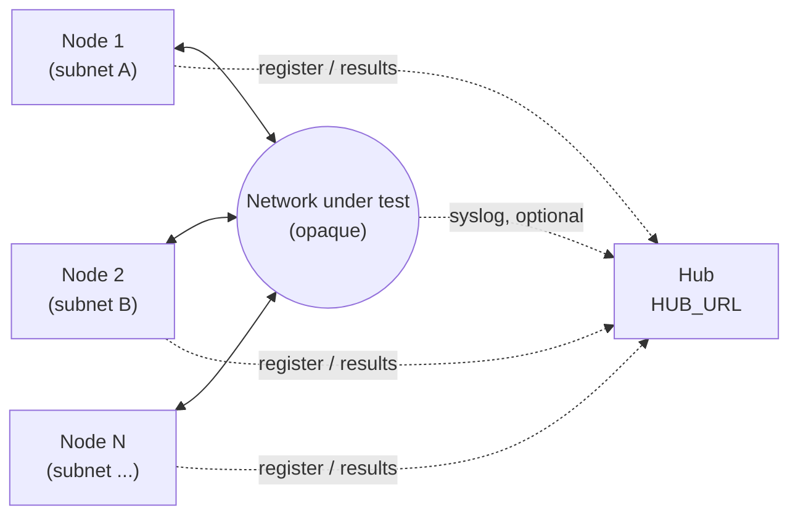

# Mesh Probe — Topology

The network between nodes is drawn as one opaque cloud on purpose: this
project tests that path, it doesn't configure it.

- **Nodes** sit one per segment under test. They test each other across the
  network, and send registrations and results to the hub over HTTP. That
  traffic doesn't have to cross the path being tested.
- **The network under test** is everything between the nodes, however many
  hops and whatever vendor. Mesh Probe only measures what gets through.
- **Syslog** is optional and one-way: devices may send it to the hub on
  UDP/514. The hub never polls or configures the network.
- **The hub** only collects and shows results. It never appears in the
  matrix.

More nodes and segments just repeat the pattern on the left.
