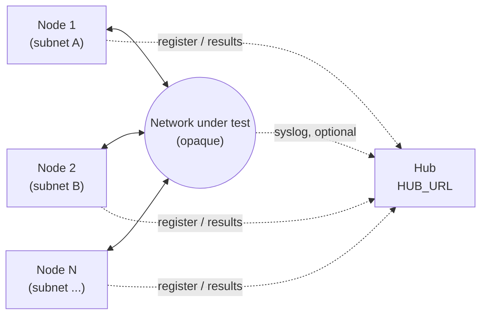

# Lab Tester — System Topology

Visual companion to the architecture in `CLAUDE.md` and the build order in
`DEPLOYMENT.md`. The network between nodes is drawn as one opaque cloud
deliberately — this project tests that path, it does not configure it.
Whatever routers, switches, or firewalls make up that cloud are the concern
of a separate project.

## Reading it

- **Nodes** sit on whatever subnets the lab defines, one per segment under
  test. Each registers with the hub and pushes results over HTTP — that
  channel is independent of, and does not need to traverse, the same path
  the tests themselves exercise.
- **The network under test** is everything between the nodes: however many
  hops, whatever vendor, however it's configured. Lab Tester treats it as a
  black box and measures what comes out the other side — HTTP, SSH, SMB,
  SMTP, iperf3, loss/jitter, path MTU, traceroute.
- **Syslog is optional and one-way.** Any device in that network *may* be
  configured to send its syslog to the hub's UDP/514 listener, which lets a
  failing pair in the matrix be read next to what the network said at that
  moment. Nothing here requires it, and the hub never reaches into the
  network to poll or configure anything.
- **The hub** is infrastructure only — it never appears as a node in the
  matrix, and its own reachability from the nodes does not require it to sit
  inside the network under test.

Scales to more nodes and more segments by repeating the pattern on the left;
the cloud in the middle does not grow more legs on this diagram no matter how
complex the real topology gets.
