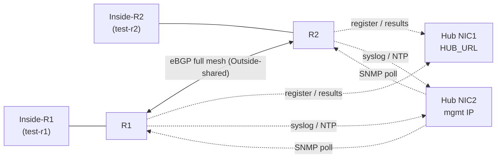
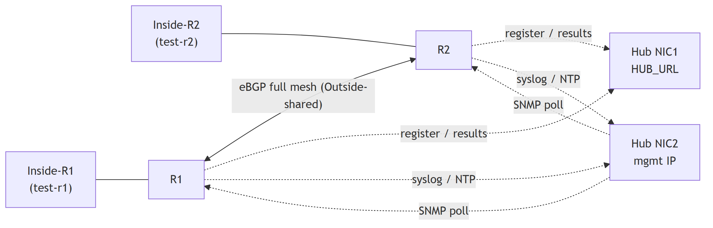

# Lab Tester — Network Topology

Visual companion to the architecture in `CLAUDE.md` and the build order in
`DEPLOYMENT.md`. Shows the same pattern as `docs/csr-example-r1.cfg` for two
routers; that file's own neighbor list additionally peers with a third (R3)
since it's written for a larger mesh. Scales the same way to more routers.

## Reading it

- **Level 1 — Inside subnets.** Each router's own inside subnet with its
  test VM (`test-r1`, `test-r2`).
- **Level 2 — Routers.** R1/R2 peer directly over Outside-shared via eBGP,
  one AS per router, no IGP underneath — peering breaks exactly when that
  segment breaks, which is the path this lab exists to test.
- **Level 3 — Hub interfaces.** Two separate NICs, two separate purposes:
  - **Hub NIC1** (`HUB_URL`, reachable via Outside-shared / global table) —
    where VMs register (`POST /register`) and push results (`POST /results`).
  - **Hub NIC2** (mgmt IP, reachable via VRF MGMT) — where routers send
    syslog and NTP (both explicitly `vrf MGMT`, see `docs/csr-baseline.cfg`),
    and where the hub polls each router's SNMP agent the other direction,
    over the same VRF.
- **The two hub NICs are deliberately unconnected** — no route leaking
  between the global table and VRF MGMT. A VM on an inside subnet has no
  path to anything in the Management VLAN, and vice versa. See
  `docs/csr-example-r1.cfg` and the acceptance check in `DEPLOYMENT.md`
  ("no management IPs in the hop list").

Scales to more routers by repeating the R*/Inside-R* pattern on the left and
adding one eBGP neighbor pair per new router.
